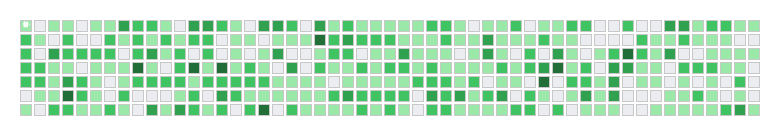

<!-- Nature & Puppy Typing Header -->

  

  

---

### 🌼 About Me

As a detail‑oriented **Business Analyst** with a strong ERP background, I specialize in turning complex business needs into clear functional specifications, data mappings, and process improvements.  
My day‑to‑day involves stakeholder collaboration, requirements gathering, prototyping (Figma), documentation (FSD/BRS), and visualizing workflows (BPMN 2.0).  
I also explore data using SQL & Python to support informed decision‑making.  
Off‑screen you’ll often find me walking my dog or tending my little indoor garden 🌱🐕.

---

### 💼 Work Experience

| 🐾 Period | 🏢 Company & Role | ✨ Highlights |
|-----------|-------------------|---------------|
| **01/2026** | **Saigon BPO** – *Business Analyst* | FSD authoring, data mapping rules for CRM/HRM, bulk upload support |
| **03/2025 – 12/2025** | **Ideco Viet Nam** – *Business Analyst* | BRS/FSD docs, BPMN 2.0, dynamic bilingual form design |
| **05/2024 – 08/2024** | **FPT Software** – *ABAP Developer Intern* | Custom ABAP reports for MM/SD, debugging data flow errors |

---

### 🎓 Education & Certifications

  **FPT University** – Bachelor of Information Technology (Software Engineering)

 

<!-- Nhóm chứng chỉ sắp xếp gọn gàng -->

  
  
   
  <!-- Hàng 1: Các chứng chỉ chính -->
  
  
  

---

### 🛠️ Technical Toolbox

  <!-- BA & Collaboration -->
  
  
  
  
  
  
  
  
   
  <!-- Data & Integration -->
  
  
  
  
  
  
  
   
  <!-- Development Essentials -->
  
  
  
  
  

---

### 🌿 Connect with me

  
  

  

